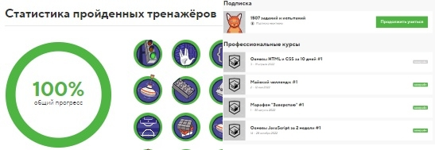
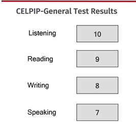

# **_Ekaterina Egorova_**

## **_Junior Frontend Developer_**

---

### Contact information

**Location:** Kitchener, ON, Canada
**Phone:** 226 5056638  
**E-mail:** <ekaterinan.egorova@gmail.com>  
**Telegram:** @katyasprz  
**Discord:** KateS(@EkaterinaEg)

### About me:

I graduated from university with a degree in Finance in Saint-Petersburg. I had been working in finance department for more than 10 years before I decided to try something different.

I was always keen on automation and creation useful features to improve routine tasks more than calculating cost and profit. Thus, I made a desicion to follow my interests and find myself in IT. I finished some courses of manual testing and business intelligence. However, it seemed to be as boring as finance. So I started learning HTML/CSS. And finally, I found that Web development is the most attractive and interesting to me. I like it since the beginning and still I am fond of Front development.

In 2022 I changed my life: new country, culture, language, people. Inspite of that I keep doing my best in learning Front-end and becoming a developer one day.

So, overall I have been learning HTML/CSS and Java Script with multiple sourses for 2 years already with some short breaks. I was really excited when my friend told me about this course. I believe that the RS School will allows me to understand my level and improve my skills.

## Skills and Proficiency:

- HTML5, CSS3
- JavaScript Basics
- Git, GitHub
- VS Code
- Adobe Photoshop, Figma

## Code example from CODEWARS:

**Task Name**: Your order, please (6 kya)

**Description:**
Your task is to sort a given string. Each word in the string will contain a single number. This number is the position the word should have in the result.
Note: Numbers can be from 1 to 9. So 1 will be the first word (not 0).
If the input string is empty, return an empty string. The words in the input String will only contain valid consecutive numbers.

```
function order(words) {
let newArr = [];
const arr = words.split(" ");
for (let i = 1; i <= 9; i++) {
arr.forEach((word) => (word.includes(i) ? newArr.push(word) : ""));
}

return newArr.join(" ");
}
```

## Courses:

- [x] [HTML academy](https://htmlacademy.ru/) tasks and Marathons of HTML Academy
      
- [x] [Coursera](https://www.coursera.org/):

  - Introduction to Front-End Development
  - HTML and CSS in depth
  - Programming with JavaScript
    

- [ ] [Udemy](https://www.udemy.com/):
      The Complete JavaScript Course 2023 (in progress)
- [ ] JavaScript Manual on [learnjavascript.ru](https://learn.javascript.ru/) (in progress)
- [ ] [RS School](https://rs.school/):
  - RS Schools Course «JavaScript/Front-end. Stage 1» (in progress)

## Portfolio:

- [Project 1](https://ekaterinaeg.github.io/Project_1/)
- [Project 2](https://ekaterinaeg.github.io/Project_2/)
- [Project 3](https://ekaterinaeg.github.io/Project_4/)

## Languages:

- **English** - B2 ([Celpip](https://www.celpip.ca/) certificate)

  

- **Russian** - Native
